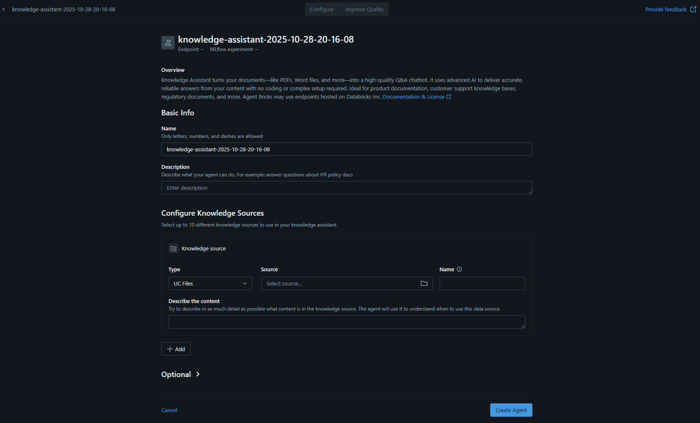

# Lab 1: Building a Q&A Agent with Databricks Agent Bricks (UI-Based / No-Code)

> 🎯 **100% UI-Based Lab**: This lab uses the Databricks Agents UI exclusively. No Python coding required!

## Overview
In this lab, you will learn how to create an intelligent Question & Answer agent using **Databricks Agents UI** with **zero coding**. Using Databricks' intuitive point-and-click interface and built-in wizards, you'll build a production-ready RAG (Retrieval Augmented Generation) agent that can answer questions about your organization's documents. 

The agent will automatically process PDF documents including employee handbooks, benefits information, and role descriptions, and provide accurate, context-aware answers to user questions.

## Learning Objectives
By the end of this lab, you will be able to:
- 🖱️ Navigate the **Databricks Agents UI** to create agents visually
- 📁 Upload and manage PDF documents through **Unity Catalog Volumes UI**
- 🔍 Configure **Vector Search** automatically using the wizard
- 🤖 Build a **Q&A agent** using the **Agent Builder visual interface**
- ✅ Test and evaluate your agent in the **built-in Playground**
- 🚀 Deploy your agent to production with **one-click deployment**
- 📊 Monitor agent performance through the **Analytics Dashboard**

## Prerequisites
- Access to a Databricks workspace 
- Databricks Runtime 14.3 LTS or higher with Serverless Compute enabled
- PDF documents for your knowledge base (provided in this repo)
- **No coding experience required!**

## Lab Architecture
```
📄 PDF Documents 
    ↓ (Upload via UI)
📁 Unity Catalog Volume 
    ↓ (Auto-processing)
🔍 Vector Search Index 
    ↓ (Configured in Agent Builder UI)
🤖 Agent Builder UI 
    ↓ (One-click creation)
💬 Q&A Agent (Ready to deploy!)
```

## ⚙️ What Happens Behind the Scenes (All Automatic!)
When you use the Agent Builder UI, Databricks automatically:
- ✨ Extracts text from your PDFs
- ✨ Chunks documents into searchable pieces
- ✨ Generates embeddings using foundation models
- ✨ Creates and syncs a vector search index
- ✨ Configures the RAG pipeline
- ✨ Sets up the LLM and retrieval logic

**You just point, click, and configure!**

---

## Step 1: Access Databricks and Navigate to Agents (5 minutes)

> 🎯 **Goal**: Find and open the Databricks Agents UI interface

### 1.1 Log into Databricks

1. Open your web browser and navigate to your Databricks workspace URL (Azure Databricks)
   - Your URL will look like: `https://adb-[workspace-id].[region].azuredatabricks.net`
2. Log in with your Microsoft Azure credentials
3. You should see the Databricks workspace home page with the sidebar navigation on the left

### 1.2 Navigate to the Agents Interface

1. Look at the left sidebar and scroll down to the **"AI/ML"** section
2. You'll see several options including:
   - Playground
   - **Agents** (with a "Beta" badge) ← Click here!
   - Experiments
   - Features
   - Models
   - Serving

3. Click on **"Agents"** to open the Agents dashboard


4. You'll see the Agents dashboard with options to create new agents

> 💡 **Note**: The Agents feature may show a "Beta" badge, which is normal. This indicates it's an actively developed feature with the latest capabilities.

### 1.3 Understand the Sidebar Navigation

The left sidebar is organized into sections:
- **Workspace** - Your notebooks and files
- **Recents** - Recently accessed items
- **Catalog** - Unity Catalog for data management
- **Jobs & Pipelines** - Scheduled workflows
- **Compute** - Cluster management
- **Marketplace** - Data sharing
- **SQL** section - SQL Editor, Queries, Dashboards, etc.
- **Data Engineering** - Job Runs, Data Ingestion
- **AI/ML** section - This is where **Agents** lives! ⭐

**✅ Checkpoint**: You should now see the Agents option in the AI/ML section of your sidebar.

### 1.4 Explore the Agents Dashboard

Once you click on **Agents**, you'll see the Agents dashboard with:

**Top Section - "Choose your use case"** with template cards (scroll horizontally to see all):

1. **Information Extraction** (Beta)
   - Extract key information & insights into structured JSON
   - Tags: Classification, Sentiment analysis, Entity resolution, Extraction, Summarization
   - Buttons: "Use PDFs" | "Build"

2. **Knowledge Assistant** (Beta) ← **We'll use this one!**
   - Turn your docs into an expert AI chatbot
   - Tags: RAG, Document Q&A
   - Button: "Build"

3. **AI/BI Genie**
   - Turn your tables into an expert AI chatbot
   - Tags: Text-to-SQL, Table Q&A, Structured data Q&A
   - Button: "Open Genie"

4. **Multi-Agent Supervisor** (Beta)
   - Design an AI system with Genie, agents, tools
   - Tags: Tool-calling, Agent orchestration
   - Button: "Build"

5. **Custom LLM** (Beta)
   - Specialize an LLM to perform custom text tasks
   - Tags: Content generation, Code generation, Translation
   - Buttons: "Use PDFs" | "Build"

6. **Code Your Own Agent**
   - Build with OSS libraries and Agent Framework
   - Tags: LangGraph, DSPy, Other OSS agent libraries
   - Buttons: "Go to docs" | "Import notebook"

> 📌 **Navigation Tip**: Use the left/right arrows (< >) at the top to scroll through all template options.

**Bottom Section** - List of your existing agents (if any) with columns:
- Name
- Problem type
- Endpoint
- Last modified

> 💡 **For this lab**: We'll click the **"Build"** button on the **Knowledge Assistant** card since we're building a Document Q&A agent!



---

## Step 2: Set Up Unity Catalog and Upload Documents (15 minutes)

> 🎯 **Goal**: Create a schema and volume in Unity Catalog, then upload your PDF documents
> 
> ⚠️ **Important**: Complete this step BEFORE building the agent, as you'll need to point the agent to these documents.

### 2.1 Navigate to Catalog

1. In the left sidebar, click on **"Catalog"**
2. You'll see the Unity Catalog interface with your catalogs listed
3. Select the **`main`** catalog (or another catalog you have access to)

### 2.2 Create a New Schema

A schema is the second layer of Unity Catalog's three-level namespace and organizes tables and views.

1. Inside your catalog, click the **"Create"** button or **"+ Schema"** option
2. You'll see the **"Create a new schema"** dialog with these fields:

   **Schema name*** (required):
   - Enter: `agent_lab`
   - This will be your workspace for the agent project

   **Storage location**:
   - Leave as default: `wsdb_demos` (or your workspace default)
   - You can also "Create a new external location" if needed
   - The full path will be displayed below (e.g., `abfss://unity-catalog-storage@...`)

   **Comment** (optional):
   - Add a description like: `Schema for agent lab with HR documents`
   - This helps document your workspace organization

    

3. Click the **"Create"** button (blue button, bottom right)

**✅ Checkpoint**: You should now see `agent_lab` schema in your catalog structure

### 2.3 Create a Unity Catalog Volume

Now let's create a volume inside the schema to store your PDF files.

1. Click on your newly created **`agent_lab`** schema
2. Click the **"Create"** button and select **"Volume"**
3. Fill in the volume creation form:
   
   **Volume name**:
   - Enter: `hr_documents_volume`
   
   **Volume type**:
   - Select **"Managed"** (Databricks manages the storage)
   - Or **"External"** if you want to use your own storage location
   
   **Comment** (optional):
   - Enter: `Storage for HR policy PDFs and documents`

    

4. Click **"Create"**

**✅ Checkpoint**: Your full volume path is now: `main.agent_lab.hr_documents_volume`

### 2.4 Upload PDF Files via UI

1. Click on the newly created volume `hr_documents_volume`
2. Click the **"Upload Files"** button
3. Drag and drop or browse to upload all your PDF files:
   - `employee_handbook.pdf`
   - `Benefit_Options.pdf`
   - `Northwind_Health_Plus_Benefits_Details.pdf`
   - `Northwind_Standard_Benefits_Details.pdf`
   - `PerksPlus.pdf`
   - `role_library.pdf`

4. Wait for the upload to complete (you'll see a progress indicator)
5. Verify all 6 files are uploaded successfully


**✅ Checkpoint**: You should now see all 6 PDF files listed in your volume

## Step 3: Create Your Knowledge Assistant Agent (20 minutes)

> 🎯 **Goal**: Configure and create your Q&A agent using the Knowledge Assistant builder

### 3.1 Start Creating a New Agent

1. Navigate back to **AI/ML** → **Agents** in the left sidebar
2. In the "Choose your use case" section at the top, locate the **"Knowledge Assistant"** card
3. This card shows:
   - "Turn your docs into an expert AI chatbot"
   - Tags: **RAG**, **Document Q&A**
4. Click the **"Build"** button on the Knowledge Assistant card

> 📝 **Why Knowledge Assistant?** This template is specifically designed for Document Q&A using RAG (Retrieval Augmented Generation), which is perfect for our HR documents use case.

### 3.2 Fill in Basic Information

You'll see the agent creation form. The page header shows:
- Agent name with timestamp (auto-generated)
- **Endpoint: —** (will be created after agent is built)
- **MLflow experiment: —** (for tracking)

Let's fill out each section:

---

**📋 Overview Section**

Read the introduction text:
> "Knowledge Assistant turns your documents—like PDFs, Word files, and more—into a high-quality Q&A chatbot. It uses advanced AI to deliver accurate, reliable answers from your content with no coding or complex setup required. Ideal for product documentation, customer support knowledge bases, regulatory documents, and more. Agent Bricks may use endpoints hosted on Databricks Inc."

There's also a link to [Documentation & License](https://docs.databricks.com) for more details.

---

**📝 Basic Info Section**

1. **Name** field (required):
   - You'll see a pre-filled name like: `knowledge-assistant-2025-10-28-20-31-33`
   - You can edit this or keep the auto-generated name
   - **For this lab, enter**: `hr_qa_agent`
   - Note below field: "Only letters, numbers, and dashes allowed"
   
   ![Example: hr_qa_agent]

2. **Description** field (optional but highly recommended):
   - Placeholder text: "Enter description"
   - Helper text: "Describe what your agent can do. For example: answer questions about HR policy docs"
   - **Enter**: 
   ```
   Answer questions about employee benefits, policies, company roles, health insurance plans, vacation policies, and HR documentation
   ```
   
   > 💡 **Why this matters**: A good description helps users understand the agent's purpose and capabilities.

---

**🗂️ Configure Knowledge Sources Section**

Header text: "Select up to 10 different knowledge sources to use in your knowledge assistant."

After you add a source, you'll see a card labeled with a folder icon (📁) and your source name (e.g., **"HR_Documents"**).

**Fill in the three main fields:**

1. **Type** dropdown:
   - Click the dropdown (shows "UC Files" by default)
   - Options available:
     - **UC Files** ← Select this for our PDFs
     - UC Tables
     - Other source types
   - Keep it as: **"UC Files"**

2. **Source** field:
   - This field shows: "Select source..."
   - Click the **folder icon** (📁) button on the right
   - A file browser dialog will open
   - Navigate through: `main` → `agent_lab` → `hr_documents_volume`
   - Select the **`hr_documents_volume`** 
   - The full path will appear: `/Volumes/wsdb_demos/agent_lab/hr_documents_volume/`
   
   ![Example path shown in interface]

3. **Name** field (optional but recommended):
   - This is an identifier for this knowledge source
   - **Enter**: `HR_Documents`
   - This label appears on the source card and helps you track multiple sources

**Describe the content** (large text area below):

This is a critical field! The helper text says:
> "Try to describe in as much detail as possible what content is in the knowledge source. The agent will use it to understand when to use this data source."

**Enter a detailed description** (use the example below or customize):
```
This knowledge source contains comprehensive HR documentation including:
- Employee benefits information (health insurance plans: Health Plus and Standard)
- Vacation and PTO policies
- Wellness programs and PerksPlus benefits
- Employee handbook with company policies and procedures
- Role library with job descriptions and company positions
- Northwind company benefits details and options

Use this source to answer employee questions about benefits, policies, time off, health insurance, wellness programs, and available roles.
```

Or use this shorter version from the screenshot example:
```
This knowledge source contains comprehensive HR documentation including:
- Employee benefits information (health insurance plans: Health Plus and Standard)
- Vacation and PTO policies
- Wellness programs and PerksPlus benefits
- Employee handbook with company policies and procedures
```

> ⚠️ **Important**: The quality of this description directly impacts how well the agent retrieves relevant information! Be specific about the types of questions this source can answer.

---

**➕ Adding Additional Sources (Optional)**

- Below the knowledge source card, you'll see a **"+ Add"** button
- Click this to add more knowledge sources (up to 10 total)
- You might add:
  - Additional volumes with different document types
  - Unity Catalog tables with structured data
  - Other file repositories

For this lab, one source with all 6 PDFs is sufficient.

---

**⚙️ Optional Settings Section**

At the bottom, you'll see an **"Optional"** section with a down arrow (▼). Click to expand it.

**Instructions (optional)** field:
- Placeholder: "Enter instructions"
- Helper text: "Provide guidelines for how the agent should respond (format, tone, etc.)"
- **Example you can enter**:
```
Provide clear, concise answers based on the HR documentation. 
Be professional and friendly in tone.
If you don't find the answer in the documents, say "I don't have that information in the available HR documentation."
Always cite the source document when answering.
```

**For this lab**: You can leave Optional settings collapsed or just add Instructions if you want to customize the agent's behavior. The defaults are well-optimized for document Q&A.


---

### 3.3 Create the Agent

**Final Review Checklist**:
- ✅ Name is filled: `hr_qa_agent`
- ✅ Description explains the agent's purpose
- ✅ Knowledge source Type: **UC Files**
- ✅ Source path selected: `main.agent_lab.hr_documents_volume`
- ✅ Name (identifier): `HR_Documents`
- ✅ Content description is detailed and specific

**Create the Agent**:

1. At the bottom of the form, you'll see two buttons:
   - **Cancel** (left, gray button)
   - **Create Agent** (right, blue button)

2. Click **"Create Agent"**

3. **Processing begins** (this takes 1-3 minutes):
   - Databricks validates your configuration
   - Extracts text from all 6 PDF files
   - Chunks documents into searchable segments
   - Generates embeddings using foundation models
   - Creates a vector search index
   - Sets up the RAG pipeline
   - Configures the endpoint

4. You'll see a progress indicator or loading screen

**✅ Success!** 

Once complete, you'll be automatically redirected to your agent's main page where you can:
- Test the agent in the playground
- View configuration details
- See the endpoint information
- Start asking questions!


> ⚠️ **First-time creation note**: The initial setup may take up to 15 minutes as Databricks provisions resources, creates the vector index, and optimizes the RAG pipeline.


> ⏱️ **Wait Time**: Initial agent creation typically takes 1-3 minutes. Grab a coffee! ☕

> 💡 **What just happened?** Databricks automatically built an entire RAG (Retrieval Augmented Generation) system with:
> - Vector database with your documents
> - Embedding model for semantic search
> - LLM for generating answers
> - Orchestration layer to tie it all together
> - All without writing a single line of code!

---

## Step 4: Test Your Agent and Improve Quality (30 minutes)

> 🎯 **Goal**: Test your agent, then use the "Improve Quality" feature to optimize responses

### 4.1 Understanding the Agent Page

Once your agent is created, you'll see the agent detail page with several sections:

**Top Header**:
- Agent name: `hr_qa_agent`
- **Endpoint**: `ka-c727bcdb-endpoint` (your serving endpoint)
- **MLflow experiment**: `ka-c727bcdb-dev-experiment` (experiment tracking link)
- Action buttons: 
  - **Configure** (edit agent settings)
  - **Improve Quality** (optimize with evaluation data)
  - **Test your Agent** (chat interface)
  - **Open in Playground** (full-screen testing)

**Left Panel - Configuration Details**:
- **Basic Info** section (editable):
  - Name: `hr_qa_agent`
  - Description with your agent's purpose
- **Configure Knowledge Sources**:
  - Shows your `HR_Documents` source
  - **Status**: ✅ "Sync successful"
  - **Last sync**: Timestamp (e.g., "Oct 28, 2025 08:40:29 PM")
  - Full description of content
  - **🔄 Sync** button to refresh
- **Optional** settings (expandable)

**Right Panel - Testing Interface**:
- Interactive chat to test your agent
- Retrieved document preview
- Response quality indicators

### 4.2 Test with Sample Questions

Click **"Test your Agent"** or use the chat interface on the right. Try these questions:

**Test Question 1:**
```
What does the Northwind Health Plus benefits plan cover?
```
Expected: Medical, dental, vision care, prescription drugs, mental health services

**Test Question 2:**
```
What is the procedure for taking maternity leave?
```
Expected: Notify HR 30 days before, provide medical documentation

**Test Question 3:**
```
What does the PerksPlus program include?
```
Expected: Gym discounts, wellness memberships, food vouchers, financial support

**Test Question 4:**
```
What are the responsibilities of a data analyst according to the role library?
```
Expected: Data collection, cleaning, analysis, strategic business reports

**Test Question 5:**
```
What are Northwind's standard benefits?
```
Expected: Basic medical insurance, paid vacation, 401(k) retirement plan

> 📝 **Note**: As you ask questions, the agent retrieves relevant document chunks and displays them in the right panel.

### 4.3 Observe the Response Quality Banner

After testing a few questions, you'll see a banner appear at the bottom of the interface:

**"Want to further improve response quality?"**

💡 Banner message:
> "Try collecting labeled data for your agent to improve quality. We will retrain and auto-optimize your agent from new data."

You have two options:
- **Dismiss** - Close the banner
- **Improve quality >** - Start the optimization process ← Click this!

### 4.4 Access the Improve Quality Feature

Click **"Improve quality >"** (or the **"Improve Quality"** button in the top header)

This opens the quality improvement interface where you can:
1. Add labeled evaluation examples
2. Run quality assessments
3. Auto-optimize your agent based on results

### 4.5 Create Evaluation Dataset

In the Improve Quality interface, you'll see:
- **Guidelines** column (left) - Instructions and tips
- **Feedback records** column (right) - Your evaluation questions
- Action buttons: **Export**, **Import**, **+ Add**

**The Process**:
1. You add questions (not answers initially)
2. Databricks runs your agent against those questions
3. You then label/review the responses
4. The system uses this labeled data to optimize

**Why this matters**:
- Helps Databricks understand your use case better
- Optimizes retrieval parameters automatically
- Improves answer accuracy and relevance
- Calibrates the model to your specific documents

### 4.5.1 Add Evaluation Questions

Click the **"+ Add"** button (blue button, top right). You'll see the **"Add a question"** dialog.

**For each question:**
1. In the text field "Enter the question", type your question
2. Click **"Add"** button
3. Repeat for all test questions

**Add these 5 evaluation questions one by one:**

**Question 1:**
```
What does the Northwind Health Plus benefits plan cover?
```

**Question 2:**
```
What is the procedure for taking maternity leave?
```

**Question 3:**
```
What does the PerksPlus program include?
```

**Question 4:**
```
What are the responsibilities of a data analyst according to the role library?
```

**Question 5:**
```
What are Northwind's standard benefits?
```

> 💡 **Note**: You only enter questions at this stage. The agent will generate answers, and then you'll label them in the next step.

### 4.5.2 Start a Labeling Session

After adding your questions:

1. On the right side, you'll see **"Get expert feedback"** section
2. Message: "You can send questions to experts for review to help build a high-quality labeled dataset. First, add questions to enable labeling."
3. Click the **"Start labeling session"** button (blue button)

**What happens next**:
1. Databricks runs your agent against all the questions you added
2. Generates responses for each question
3. You'll be able to review and label each response as:
   - ✅ **Good** - Accurate and complete answer
   - ⚠️ **Needs improvement** - Partially correct
   - ❌ **Poor** - Incorrect or irrelevant
4. You can also edit the expected answer or provide feedback

> 💡 **Best Practice**: Add 10-20 diverse examples covering different topics and document types for best results. For this lab, 5 examples are sufficient to see improvement.

### 4.6 Run Quality Evaluation and Label Responses

Once you start the labeling session:

1. **Agent generates responses**: Databricks will run your agent against each question you added

2. **Review the Evaluation Table**: You'll see a table with columns:
   - **Inputs**: Your questions
   - **Expectations**: A JSON structure showing what you expect (guidelines and expected answer)
   - **Last Updated**: Timestamp
   - **Source**: Where the question came from
   - **Tags**: Optional labels

**Understanding the Expectations Format**:

The expectations are stored in JSON format like this:
```json
{
  "guidelines": [
    "The Northwind Health Plus plan covers medical, dental, and vision care, prescription drugs, and mental health services."
  ]
}
```

This format allows Databricks to compare the agent's actual response against your expected answer.

3. **Review each response**:
   - The system will show the agent's actual answer
   - You can compare it to your expected answer in the guidelines
   - ✅ Click **thumbs up** if the answer matches expectations
   - ❌ Click **thumbs down** if the answer is incorrect or incomplete
   - 📝 Add comments or corrections
   - ✏️ Edit the expected answer if needed

4. **For our 5 questions, the system should have these expectations configured**:

   **Q1: What does the Northwind Health Plus benefits plan cover?**
   - Expected: `The Northwind Health Plus plan covers medical, dental, and vision care, prescription drugs, and mental health services.`
   
   **Q2: What is the procedure for taking maternity leave?**
   - Expected: `You must notify Human Resources at least 30 days before the expected date and provide the corresponding medical documentation.`
   
   **Q3: What does the PerksPlus program include?**
   - Expected: `PerksPlus includes discounts on gyms, wellness memberships, food vouchers, and financial support.`
   
   **Q4: What are the responsibilities of a data analyst according to the role library?**
   - Expected: `According to the Role Library, a data analyst is responsible for collecting, cleaning, and analyzing data to generate strategic business reports.`
   
   **Q5: What are Northwind's standard benefits?**
   - Expected: `Standard benefits include basic medical insurance, paid vacation, and a 401(k) retirement plan.`

5. **Review and run evaluation**: 
   - Click the **"Columns"** dropdown to customize what you see
   - Use the search bar to filter specific questions
   - Click the refresh button (🔄) to reload data
   - When ready, look for an **"Evaluate"** or **"Run"** button to start the evaluation

6. **Save your changes**: Click **"Save changes"** button (top right) to preserve your evaluation dataset

**Databricks will automatically**:
   - Compare actual responses to your expected answers in the guidelines
   - Calculate similarity and relevance scores
   - Identify which documents were retrieved
   - Measure response quality metrics

7. **Review the evaluation results** (after running evaluation):
   - ✅ **Pass** - Response matches expected answer well
   - ⚠️ **Partial** - Response is somewhat accurate
   - ❌ **Fail** - Response doesn't match or is incorrect
   - **Similarity Score** - Numerical score (0-1)
   - **Retrieved Docs** - Which source documents were used

> 💡 **Tip**: You can also **Export** your evaluation dataset to save it locally or **Import** existing evaluation data using the buttons at the top.

**✅ Checkpoint**: Your agent should now provide high-quality, accurate answers to HR-related questions!

> 🎓 **What you learned**: The "Improve Quality" feature with labeling sessions uses your evaluation data to automatically tune dozens of parameters behind the scenes, turning your good agent into a great one!

---

## Lab Summary

🎉 Congratulations! You have successfully created a production-ready Q&A agent **without writing any code**!

### What You Accomplished:
✅ Uploaded PDF documents using Unity Catalog Volumes UI
✅ Created a Q&A agent using the visual Agent Builder
✅ Configured vector search and embeddings automatically
✅ Tested and evaluated agent responses in the Playground

### Key Takeaways:
- **No coding required**: Everything done through Databricks UI
- **Automatic document processing**: PDFs are parsed and chunked automatically
- **One-click deployment**: From testing to production in minutes
- **Built-in evaluation**: Metrics and feedback collection included
- **Easy maintenance**: Add new documents without rebuilding

---

**Lab Duration**: Approximately 60-90 minutes
**Difficulty Level**: Beginner (No coding required!)
**Last Updated**: October 2025
